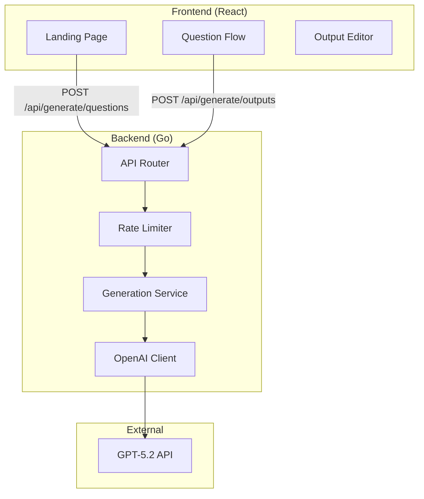

# Design Document: AI-Driven Generation

## Overview

This design transforms BetterKiroPrompts from a multi-page template-based application into a single-page AI-driven experience. The user enters a project idea, receives AI-generated contextual questions, answers them, and receives tailored kickoff prompts, steering files, and hooks—all generated by GPT-5.2.

## Architecture



## Components and Interfaces

### Frontend Components

#### LandingPage Component
Single page managing the entire flow through state transitions.

```typescript
interface LandingPageState {
  phase: 'input' | 'questions' | 'generating' | 'output' | 'error'
  projectIdea: string
  questions: Question[]
  answers: Map<number, string>
  currentQuestionIndex: number
  generatedFiles: GeneratedFile[]
  editedFiles: Map<string, string>
  error: string | null
}

interface Question {
  id: number
  text: string
  hint?: string
}

interface GeneratedFile {
  path: string
  content: string
  type: 'kickoff' | 'steering' | 'hook'
}
```

#### ProjectInput Component
Initial input field with example suggestions.

```typescript
interface ProjectInputProps {
  onSubmit: (idea: string) => void
  loading: boolean
  examples: string[]
}
```

#### QuestionFlow Component
Displays questions one at a time with previous answers visible.

```typescript
interface QuestionFlowProps {
  questions: Question[]
  answers: Map<number, string>
  currentIndex: number
  onAnswer: (questionId: number, answer: string) => void
  onBack: (questionId: number) => void
  onComplete: () => void
}
```

#### OutputEditor Component
Displays and allows editing of generated files.

```typescript
interface OutputEditorProps {
  files: GeneratedFile[]
  editedFiles: Map<string, string>
  onEdit: (path: string, content: string) => void
  onReset: (path: string) => void
  onDownloadAll: () => void
  onDownloadFile: (path: string) => void
  onCopyFile: (path: string) => void
}
```

### Backend Components

#### API Endpoints

```
POST /api/generate/questions
  Request:  { projectIdea: string }
  Response: { questions: Question[] }
  Errors:   400 (invalid input), 429 (rate limited), 500 (AI error)

POST /api/generate/outputs
  Request:  { projectIdea: string, answers: { questionId: number, answer: string }[] }
  Response: { files: GeneratedFile[] }
  Errors:   400 (invalid input), 429 (rate limited), 500 (AI error)

GET /api/health
  Response: { status: "ok" }
```

#### Generation Service

```go
type GenerationService struct {
    openaiClient *OpenAIClient
    rateLimiter  *RateLimiter
}

func (s *GenerationService) GenerateQuestions(ctx context.Context, projectIdea string) ([]Question, error)
func (s *GenerationService) GenerateOutputs(ctx context.Context, projectIdea string, answers []Answer) (*GeneratedOutputs, error)
```

#### OpenAI Client

```go
type OpenAIClient struct {
    apiKey     string
    httpClient *http.Client
    baseURL    string
}

func (c *OpenAIClient) ChatCompletion(ctx context.Context, messages []Message) (string, error)
```

#### Rate Limiter

```go
type RateLimiter struct {
    store    map[string]*clientState  // IP -> state
    mu       sync.RWMutex
    limit    int           // 10 requests
    window   time.Duration // 1 hour
}

type clientState struct {
    count     int
    windowStart time.Time
}

func (r *RateLimiter) Allow(ip string) (bool, time.Duration)
```

## Data Models

### API Request/Response Types

```go
// Question generation
type GenerateQuestionsRequest struct {
    ProjectIdea string `json:"projectIdea"`
}

type GenerateQuestionsResponse struct {
    Questions []Question `json:"questions"`
}

type Question struct {
    ID   int    `json:"id"`
    Text string `json:"text"`
    Hint string `json:"hint,omitempty"`
}

// Output generation
type GenerateOutputsRequest struct {
    ProjectIdea string   `json:"projectIdea"`
    Answers     []Answer `json:"answers"`
}

type Answer struct {
    QuestionID int    `json:"questionId"`
    Answer     string `json:"answer"`
}

type GenerateOutputsResponse struct {
    Files []GeneratedFile `json:"files"`
}

type GeneratedFile struct {
    Path    string `json:"path"`
    Content string `json:"content"`
    Type    string `json:"type"` // "kickoff", "steering", "hook"
}
```

### OpenAI API Types

```go
type ChatCompletionRequest struct {
    Model    string    `json:"model"`
    Messages []Message `json:"messages"`
}

type Message struct {
    Role    string `json:"role"`
    Content string `json:"content"`
}

type ChatCompletionResponse struct {
    Choices []Choice `json:"choices"`
}

type Choice struct {
    Message Message `json:"message"`
}
```

## Correctness Properties

*A property is a characteristic or behavior that should hold true across all valid executions of a system—essentially, a formal statement about what the system should do. Properties serve as the bridge between human-readable specifications and machine-verifiable correctness guarantees.*

### Property 1: Question Plan Structure
*For any* valid question generation response, the response SHALL contain between 5 and 10 questions, each with a non-empty text field.
**Validates: Requirements 2.2**

### Property 2: Generation Response Completeness
*For any* valid output generation response, the response SHALL contain a non-empty kickoff prompt, at least one steering file, and at least one hook file.
**Validates: Requirements 3.2, 3.3, 3.4**

### Property 3: Edit State Preservation
*For any* file edit action in the Output_Editor, the edited content SHALL be preserved in state and reflected in subsequent reads.
**Validates: Requirements 4.3**

### Property 4: Download Content Integrity
*For any* file download (individual or ZIP), the downloaded content SHALL match the current edited state if modifications were made, or the original content if not.
**Validates: Requirements 5.3**

### Property 5: ZIP Directory Structure
*For any* generated ZIP file, all steering files SHALL be under `.kiro/steering/` and all hook files SHALL be under `.kiro/hooks/`.
**Validates: Requirements 5.4**

### Property 6: Rate Limiting Enforcement
*For any* IP address making more than 10 generation requests within one hour, the 11th and subsequent requests SHALL receive HTTP 429 response.
**Validates: Requirements 6.3**

### Property 7: Input Validation
*For any* request with empty or whitespace-only projectIdea, the Generation_Service SHALL reject the request with HTTP 400 before calling OpenAI API.
**Validates: Requirements 6.5**

## Error Handling

### Frontend Error States

| Error Type | User Message | Action |
|------------|--------------|--------|
| Network error | "Unable to connect. Please check your connection." | Show error, no retry |
| Rate limited | "Too many requests. Please try again in X minutes." | Show countdown |
| AI generation failed | "Generation failed. Please refresh and try again." | Show refresh instruction |
| Timeout | "Request timed out. Please refresh and start over." | Show refresh instruction |

### Backend Error Responses

```go
type ErrorResponse struct {
    Error      string `json:"error"`
    RetryAfter int    `json:"retryAfter,omitempty"` // seconds, for 429
}
```

| HTTP Code | Condition | Response |
|-----------|-----------|----------|
| 400 | Invalid/empty input | `{"error": "Project idea is required"}` |
| 429 | Rate limit exceeded | `{"error": "Rate limit exceeded", "retryAfter": 3600}` |
| 500 | OpenAI API error | `{"error": "Generation failed. Please try again later."}` |
| 504 | Timeout | `{"error": "Request timed out"}` |

## Testing Strategy

### Unit Tests
- Input validation functions
- Rate limiter logic (allow/deny decisions)
- ZIP file generation with correct structure
- State management in frontend components

### Property-Based Tests
- Question plan structure validation (Property 1)
- Generation response completeness (Property 2)
- Edit state preservation (Property 3)
- Download content integrity (Property 4)
- ZIP structure validation (Property 5)
- Rate limiting enforcement (Property 6)
- Input validation (Property 7)

### Integration Tests
- Full flow: project idea → questions → answers → outputs
- Error handling: mock OpenAI failures
- Rate limiting: verify 429 after limit exceeded

### Testing Framework
- Backend: Go standard testing + `testing/quick` for property tests
- Frontend: Vitest + React Testing Library
- E2E: Playwright (existing setup)

## AI Prompts

### Question Generation Prompt

```
You are helping a developer plan their project. Based on their project idea, generate 5-10 follow-up questions to understand their requirements better.

Rules:
- Adapt question complexity to the project sophistication
- For simple projects (games, basic apps): focus on scope, platform, basic features
- For complex projects (distributed systems, APIs): include architecture, scalability, data consistency
- Questions should help clarify: users, data, auth, tech stack, constraints
- Return JSON array of questions with id, text, and optional hint

Project idea: {projectIdea}

Response format:
{"questions": [{"id": 1, "text": "...", "hint": "..."}]}
```

### Output Generation Prompt

```
You are generating Kiro project files for a developer. Based on their project idea and answers, generate:

1. A kickoff prompt (markdown) that summarizes the project requirements
2. Steering files for .kiro/steering/ with appropriate frontmatter
3. Hook files for .kiro/hooks/ in valid Kiro hook JSON format

Rules:
- Kickoff prompt should enforce "answer questions before coding" principle
- Steering files should be concise and actionable
- Include product.md, tech.md, structure.md at minimum
- Add security/quality steering if project warrants it
- Hooks should match project tech stack (Go, TypeScript, React, etc.)
- Use valid Kiro hook schema with name, description, version, enabled, when, then

Project idea: {projectIdea}
Answers: {answers as JSON}

Response format:
{
  "files": [
    {"path": "kickoff-prompt.md", "content": "...", "type": "kickoff"},
    {"path": ".kiro/steering/product.md", "content": "...", "type": "steering"},
    {"path": ".kiro/hooks/format.kiro.hook", "content": "...", "type": "hook"}
  ]
}
```

## Security Considerations

### API Key Management
- OpenAI API key stored in `OPENAI_API_KEY` environment variable
- Never logged, never included in error responses
- Loaded once at startup, not per-request

### Input Sanitization
- Project idea: max 2000 characters, trimmed, no control characters
- Answers: max 1000 characters each, trimmed
- All input validated before OpenAI API call

### Rate Limiting Implementation
- In-memory store (acceptable for single-instance MVP)
- Key: client IP from X-Forwarded-For or RemoteAddr
- Window: sliding 1-hour window
- Limit: 10 requests per window
- Returns Retry-After header with seconds until reset

### Timeout Configuration
- OpenAI API calls: 60 second timeout
- HTTP server: 90 second request timeout
- Context cancellation propagated to OpenAI client

## Files to Remove (Cleanup)

### Frontend
- `src/pages/KickoffPage.tsx`
- `src/pages/SteeringPage.tsx`
- `src/pages/HooksPage.tsx`
- `src/components/kickoff/*` (entire directory)
- `src/components/steering/*` (entire directory)
- `src/components/hooks/*` (entire directory)
- `src/components/shared/Navigation.tsx`
- `src/components/shared/StepIndicator.tsx`

### Backend
- `internal/api/kickoff.go`
- `internal/api/steering.go`
- `internal/api/hooks.go`
- `internal/generator/kickoff.go`
- `internal/generator/steering.go`
- `internal/generator/hooks.go`
- `internal/templates/*.tmpl` (all template files)
- `internal/templates/steering/*` (entire directory)
- `internal/templates/hooks/*` (entire directory)

### Keep and Modify
- `src/App.tsx` - simplify to single LandingPage
- `src/lib/api.ts` - replace with new API functions
- `src/components/shared/OutputPanel.tsx` - reuse for file display
- `src/components/shared/ErrorMessage.tsx` - reuse
- `src/components/shared/Spinner.tsx` - reuse
- `internal/api/router.go` - update routes
- `internal/templates/templates.go` - remove or repurpose
