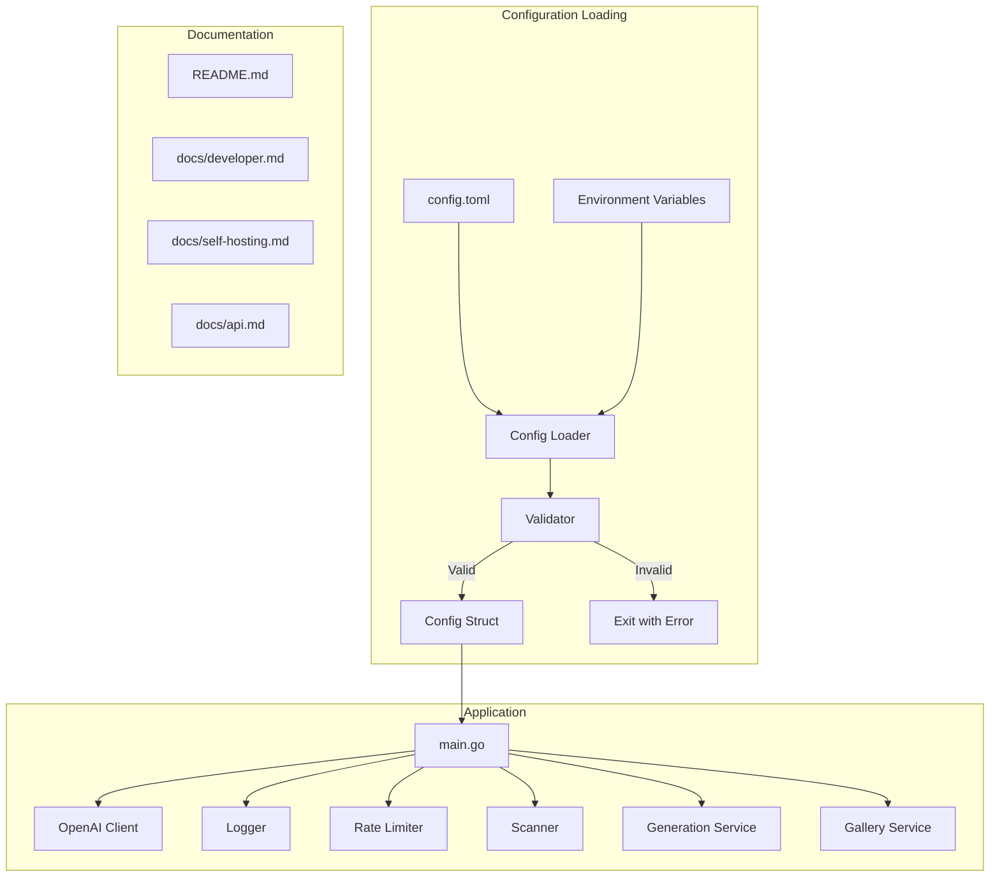

# Design Document: Documentation and Configuration

## Overview

This design implements a centralized TOML configuration system and comprehensive documentation for BetterKiroPrompts. The configuration system extracts all hardcoded values into a single `config.toml` file, while maintaining backward compatibility with existing environment variables. Documentation includes an updated README, developer architecture guide, and self-hosting guide.

## Architecture



## Components and Interfaces

### 1. Configuration Package (`backend/internal/config`)

The core configuration loading and validation system.

```go
package config

import (
    "fmt"
    "os"
    "time"
    
    "github.com/BurntSushi/toml"
)

// Config holds all application configuration
type Config struct {
    Server     ServerConfig     `toml:"server"`
    OpenAI     OpenAIConfig     `toml:"openai"`
    RateLimit  RateLimitConfig  `toml:"rate_limit"`
    Logging    LoggingConfig    `toml:"logging"`
    Scanner    ScannerConfig    `toml:"scanner"`
    Generation GenerationConfig `toml:"generation"`
    Gallery    GalleryConfig    `toml:"gallery"`
}

// ServerConfig holds HTTP server settings
type ServerConfig struct {
    Port            int           `toml:"port"`
    Host            string        `toml:"host"`
    ShutdownTimeout time.Duration `toml:"shutdown_timeout"`
}

// OpenAIConfig holds OpenAI API settings
type OpenAIConfig struct {
    Model           string        `toml:"model"`
    CodeReviewModel string        `toml:"code_review_model"`
    BaseURL         string        `toml:"base_url"`
    Timeout         time.Duration `toml:"timeout"`
    ReasoningEffort string        `toml:"reasoning_effort"`
    Verbosity       string        `toml:"verbosity"`
}

// RateLimitConfig holds rate limiting settings
type RateLimitConfig struct {
    GenerationLimitPerHour int `toml:"generation_limit_per_hour"`
    RatingLimitPerHour     int `toml:"rating_limit_per_hour"`
    ScanLimitPerHour       int `toml:"scan_limit_per_hour"`
}

// LoggingConfig holds logging settings
type LoggingConfig struct {
    Level       string `toml:"level"`
    Directory   string `toml:"directory"`
    MaxSizeMB   int    `toml:"max_size_mb"`
    MaxAgeDays  int    `toml:"max_age_days"`
    EnableColor bool   `toml:"enable_color"`
}

// ScannerConfig holds security scanner settings
type ScannerConfig struct {
    MaxRepoSizeMB      int           `toml:"max_repo_size_mb"`
    MaxReviewFiles     int           `toml:"max_review_files"`
    ToolTimeoutSeconds int           `toml:"tool_timeout_seconds"`
    RetentionDays      int           `toml:"retention_days"`
    CloneTimeout       time.Duration `toml:"clone_timeout"`
}

// GenerationConfig holds AI generation settings
type GenerationConfig struct {
    MaxProjectIdeaLength int `toml:"max_project_idea_length"`
    MaxAnswerLength      int `toml:"max_answer_length"`
    MinQuestions         int `toml:"min_questions"`
    MaxQuestions         int `toml:"max_questions"`
    MaxRetries           int `toml:"max_retries"`
}

// GalleryConfig holds gallery settings
type GalleryConfig struct {
    PageSize    int    `toml:"page_size"`
    DefaultSort string `toml:"default_sort"`
}

// Load reads configuration from file and environment
func Load() (*Config, error)

// LoadFromPath reads configuration from a specific path
func LoadFromPath(path string) (*Config, error)

// Validate checks all configuration values
func (c *Config) Validate() error

// ApplyEnvironmentOverrides applies env var overrides
func (c *Config) ApplyEnvironmentOverrides()
```

### 2. Default Configuration

```go
// DefaultConfig returns configuration with sensible defaults
func DefaultConfig() *Config {
    return &Config{
        Server: ServerConfig{
            Port:            8080,
            Host:            "0.0.0.0",
            ShutdownTimeout: 30 * time.Second,
        },
        OpenAI: OpenAIConfig{
            Model:           "gpt-5.2",
            CodeReviewModel: "gpt-5.1-codex-max",
            BaseURL:         "https://api.openai.com/v1",
            Timeout:         180 * time.Second,
            ReasoningEffort: "medium",
            Verbosity:       "medium",
        },
        RateLimit: RateLimitConfig{
            GenerationLimitPerHour: 10,
            RatingLimitPerHour:     20,
            ScanLimitPerHour:       10,
        },
        Logging: LoggingConfig{
            Level:       "INFO",
            Directory:   "./logs",
            MaxSizeMB:   100,
            MaxAgeDays:  7,
            EnableColor: true,
        },
        Scanner: ScannerConfig{
            MaxRepoSizeMB:      500,
            MaxReviewFiles:     10,
            ToolTimeoutSeconds: 300,
            RetentionDays:      7,
            CloneTimeout:       5 * time.Minute,
        },
        Generation: GenerationConfig{
            MaxProjectIdeaLength: 2000,
            MaxAnswerLength:      1000,
            MinQuestions:         5,
            MaxQuestions:         10,
            MaxRetries:           1,
        },
        Gallery: GalleryConfig{
            PageSize:    20,
            DefaultSort: "newest",
        },
    }
}
```

### 3. Configuration Loading Logic

```go
// Load reads configuration with the following precedence:
// 1. Default values
// 2. config.toml file values
// 3. Environment variable overrides
func Load() (*Config, error) {
    cfg := DefaultConfig()
    
    // Determine config path
    configPath := os.Getenv("CONFIG_PATH")
    if configPath == "" {
        configPath = "config.toml"
    }
    
    // Load from file if exists
    if _, err := os.Stat(configPath); err == nil {
        if _, err := toml.DecodeFile(configPath, cfg); err != nil {
            return nil, fmt.Errorf("failed to parse config file: %w", err)
        }
    }
    
    // Apply environment overrides
    cfg.ApplyEnvironmentOverrides()
    
    // Validate
    if err := cfg.Validate(); err != nil {
        return nil, fmt.Errorf("configuration validation failed: %w", err)
    }
    
    return cfg, nil
}

// ApplyEnvironmentOverrides reads env vars and overrides config values
func (c *Config) ApplyEnvironmentOverrides() {
    // Server
    if v := os.Getenv("PORT"); v != "" {
        if port, err := strconv.Atoi(v); err == nil {
            c.Server.Port = port
        }
    }
    
    // Logging
    if v := os.Getenv("LOG_LEVEL"); v != "" {
        c.Logging.Level = v
    }
    
    // OpenAI model override
    if v := os.Getenv("OPENAI_MODEL"); v != "" {
        c.OpenAI.Model = v
    }
    
    // Scanner overrides (existing env vars)
    if v := os.Getenv("SCANNER_MAX_REPO_SIZE_MB"); v != "" {
        if size, err := strconv.Atoi(v); err == nil {
            c.Scanner.MaxRepoSizeMB = size
        }
    }
    if v := os.Getenv("SCANNER_MAX_REVIEW_FILES"); v != "" {
        if files, err := strconv.Atoi(v); err == nil {
            c.Scanner.MaxReviewFiles = files
        }
    }
    if v := os.Getenv("SCANNER_TOOL_TIMEOUT_SECONDS"); v != "" {
        if timeout, err := strconv.Atoi(v); err == nil {
            c.Scanner.ToolTimeoutSeconds = timeout
        }
    }
    if v := os.Getenv("SCANNER_RESULT_RETENTION_DAYS"); v != "" {
        if days, err := strconv.Atoi(v); err == nil {
            c.Scanner.RetentionDays = days
        }
    }
}
```

### 4. Configuration Validation

```go
// Validate checks all configuration values are within acceptable ranges
func (c *Config) Validate() error {
    var errs []string
    
    // Server validation
    if c.Server.Port < 1 || c.Server.Port > 65535 {
        errs = append(errs, fmt.Sprintf("server.port must be 1-65535, got %d", c.Server.Port))
    }
    if c.Server.ShutdownTimeout < time.Second {
        errs = append(errs, "server.shutdown_timeout must be at least 1s")
    }
    
    // OpenAI validation
    if c.OpenAI.Model == "" {
        errs = append(errs, "openai.model is required")
    }
    validEfforts := map[string]bool{"none": true, "low": true, "medium": true, "high": true, "xhigh": true}
    if !validEfforts[c.OpenAI.ReasoningEffort] {
        errs = append(errs, fmt.Sprintf("openai.reasoning_effort must be one of: none, low, medium, high, xhigh; got %s", c.OpenAI.ReasoningEffort))
    }
    validVerbosity := map[string]bool{"low": true, "medium": true, "high": true}
    if !validVerbosity[c.OpenAI.Verbosity] {
        errs = append(errs, fmt.Sprintf("openai.verbosity must be one of: low, medium, high; got %s", c.OpenAI.Verbosity))
    }
    if c.OpenAI.Timeout < 10*time.Second {
        errs = append(errs, "openai.timeout must be at least 10s")
    }
    
    // Rate limit validation
    if c.RateLimit.GenerationLimitPerHour < 1 {
        errs = append(errs, "rate_limit.generation_limit_per_hour must be at least 1")
    }
    if c.RateLimit.RatingLimitPerHour < 1 {
        errs = append(errs, "rate_limit.rating_limit_per_hour must be at least 1")
    }
    if c.RateLimit.ScanLimitPerHour < 1 {
        errs = append(errs, "rate_limit.scan_limit_per_hour must be at least 1")
    }
    
    // Logging validation
    validLevels := map[string]bool{"DEBUG": true, "INFO": true, "WARN": true, "ERROR": true}
    if !validLevels[strings.ToUpper(c.Logging.Level)] {
        errs = append(errs, fmt.Sprintf("logging.level must be one of: DEBUG, INFO, WARN, ERROR; got %s", c.Logging.Level))
    }
    if c.Logging.MaxSizeMB < 1 {
        errs = append(errs, "logging.max_size_mb must be at least 1")
    }
    if c.Logging.MaxAgeDays < 1 {
        errs = append(errs, "logging.max_age_days must be at least 1")
    }
    
    // Scanner validation
    if c.Scanner.MaxRepoSizeMB < 1 {
        errs = append(errs, "scanner.max_repo_size_mb must be at least 1")
    }
    if c.Scanner.MaxReviewFiles < 1 {
        errs = append(errs, "scanner.max_review_files must be at least 1")
    }
    if c.Scanner.ToolTimeoutSeconds < 10 {
        errs = append(errs, "scanner.tool_timeout_seconds must be at least 10")
    }
    if c.Scanner.RetentionDays < 1 {
        errs = append(errs, "scanner.retention_days must be at least 1")
    }
    
    // Generation validation
    if c.Generation.MaxProjectIdeaLength < 100 {
        errs = append(errs, "generation.max_project_idea_length must be at least 100")
    }
    if c.Generation.MaxAnswerLength < 100 {
        errs = append(errs, "generation.max_answer_length must be at least 100")
    }
    if c.Generation.MinQuestions < 1 {
        errs = append(errs, "generation.min_questions must be at least 1")
    }
    if c.Generation.MaxQuestions < c.Generation.MinQuestions {
        errs = append(errs, "generation.max_questions must be >= min_questions")
    }
    
    // Gallery validation
    if c.Gallery.PageSize < 1 || c.Gallery.PageSize > 100 {
        errs = append(errs, "gallery.page_size must be 1-100")
    }
    validSorts := map[string]bool{"newest": true, "highest_rated": true, "most_viewed": true}
    if !validSorts[c.Gallery.DefaultSort] {
        errs = append(errs, fmt.Sprintf("gallery.default_sort must be one of: newest, highest_rated, most_viewed; got %s", c.Gallery.DefaultSort))
    }
    
    if len(errs) > 0 {
        return fmt.Errorf("validation errors:\n  - %s", strings.Join(errs, "\n  - "))
    }
    
    return nil
}
```

## Data Models

### config.toml File Structure

```toml
# BetterKiroPrompts Configuration
# All values shown are defaults - uncomment and modify as needed

[server]
port = 8080
host = "0.0.0.0"
shutdown_timeout = "30s"

[openai]
# Model for question and output generation
model = "gpt-5.2"
# Model for security code review (optimized for code analysis)
code_review_model = "gpt-5.1-codex-max"
base_url = "https://api.openai.com/v1"
timeout = "180s"
# Reasoning effort: none, low, medium, high, xhigh
reasoning_effort = "medium"
# Output verbosity: low, medium, high
verbosity = "medium"

[rate_limit]
# Maximum generations per IP per hour
generation_limit_per_hour = 10
# Maximum ratings per IP per hour
rating_limit_per_hour = 20
# Maximum security scans per IP per hour
scan_limit_per_hour = 10

[logging]
# Log level: DEBUG, INFO, WARN, ERROR
level = "INFO"
directory = "./logs"
max_size_mb = 100
max_age_days = 7
enable_color = true

[scanner]
# Maximum repository size to clone (MB)
max_repo_size_mb = 500
# Maximum files to send to AI for code review
max_review_files = 10
# Timeout for each security tool (seconds)
tool_timeout_seconds = 300
# Days to retain scan results
retention_days = 7
# Clone operation timeout
clone_timeout = "5m"

[generation]
# Maximum length of project idea input
max_project_idea_length = 2000
# Maximum length of each answer
max_answer_length = 1000
# Question count range
min_questions = 5
max_questions = 10
# Retry attempts for AI generation
max_retries = 1

[gallery]
# Items per page
page_size = 20
# Default sort: newest, highest_rated, most_viewed
default_sort = "newest"
```

## Correctness Properties

*A property is a characteristic or behavior that should hold true across all valid executions of a system—essentially, a formal statement about what the system should do. Properties serve as the bridge between human-readable specifications and machine-verifiable correctness guarantees.*

### Property 1: Config Structure Completeness
*For any* valid config.toml file, parsing it SHALL produce a Config struct with all required sections (server, openai, rate_limit, logging, scanner, generation, gallery) populated.
**Validates: Requirements 1.1, 1.2, 1.3, 1.4, 1.5, 1.6, 1.7**

### Property 2: Default Value Fallback
*For any* missing config.toml file or missing section, the Config_Loader SHALL return a Config struct with default values matching the documented defaults.
**Validates: Requirements 1.8**

### Property 3: Invalid Config Rejection
*For any* config.toml with values outside valid ranges, the Config_Loader SHALL return an error describing the specific invalid field and its valid range.
**Validates: Requirements 1.9, 7.1, 7.2, 7.3**

### Property 4: Environment Variable Override
*For any* configuration value that has both a config.toml value and an environment variable set, the environment variable value SHALL take precedence.
**Validates: Requirements 2.2**

### Property 5: Sensitive Value Redaction
*For any* logged configuration output, sensitive values (API keys, tokens, passwords) SHALL NOT appear in the log output.
**Validates: Requirements 2.4**

### Property 6: Config Round-Trip
*For any* valid Config struct, serializing to TOML and parsing back SHALL produce an equivalent Config struct.
**Validates: Requirements 1.1-1.7**

## Error Handling

### Configuration Errors

| Error Type | Message Format | Exit Code |
|------------|----------------|-----------|
| File parse error | "failed to parse config file: {details}" | 1 |
| Missing required field | "validation errors:\n  - {field} is required" | 1 |
| Invalid range | "validation errors:\n  - {field} must be {range}, got {value}" | 1 |
| Invalid enum | "validation errors:\n  - {field} must be one of: {options}; got {value}" | 1 |

### Startup Logging

```go
// Log configuration at startup (with redaction)
func (c *Config) LogConfig(log *slog.Logger) {
    log.Info("configuration_loaded",
        slog.Group("server",
            slog.Int("port", c.Server.Port),
            slog.String("host", c.Server.Host),
            slog.Duration("shutdown_timeout", c.Server.ShutdownTimeout),
        ),
        slog.Group("openai",
            slog.String("model", c.OpenAI.Model),
            slog.String("code_review_model", c.OpenAI.CodeReviewModel),
            slog.String("base_url", c.OpenAI.BaseURL),
            slog.Duration("timeout", c.OpenAI.Timeout),
            slog.String("reasoning_effort", c.OpenAI.ReasoningEffort),
        ),
        slog.Group("rate_limit",
            slog.Int("generation_per_hour", c.RateLimit.GenerationLimitPerHour),
            slog.Int("rating_per_hour", c.RateLimit.RatingLimitPerHour),
            slog.Int("scan_per_hour", c.RateLimit.ScanLimitPerHour),
        ),
        slog.Group("logging",
            slog.String("level", c.Logging.Level),
            slog.String("directory", c.Logging.Directory),
        ),
        slog.Group("scanner",
            slog.Int("max_repo_size_mb", c.Scanner.MaxRepoSizeMB),
            slog.Int("max_review_files", c.Scanner.MaxReviewFiles),
        ),
    )
}
```

## Testing Strategy

### Unit Tests
- Config parsing from valid TOML
- Default value application when file missing
- Environment variable override precedence
- Validation error messages for each field type
- TOML serialization round-trip

### Property-Based Tests
- Property 1: Config structure completeness (generate random valid configs)
- Property 2: Default fallback (test with missing file/sections)
- Property 3: Invalid config rejection (generate invalid values)
- Property 4: Env var override (generate config + env var combinations)
- Property 5: Sensitive value redaction (verify no secrets in logs)
- Property 6: Round-trip serialization

### Testing Framework
- Backend: Go standard testing + `testing/quick` for property tests
- Use `github.com/BurntSushi/toml` for TOML parsing

## Documentation Structure

### README.md Updates

```markdown
# BetterKiroPrompts

A tool that generates better prompts, steering documents, and Kiro hooks 
to improve beginner thinking—not write applications for them.

## Features

- **AI-Driven Generation**: Enter your project idea, answer contextual questions, 
  get tailored kickoff prompts, steering files, hooks, and AGENTS.md
- **Public Gallery**: Browse and rate community generations for inspiration
- **Security Scanning**: Scan repositories for vulnerabilities with AI-powered remediation

## Quick Start

1. Clone and configure:
   ```bash
   git clone <repo-url>
   cd Better-Kiro-Prompts
   cp .env.example .env
   cp config.example.toml config.toml
   # Edit .env with your OPENAI_API_KEY
   ```

2. Start the application:
   ```bash
   ./build.sh
   ```

3. Open http://localhost:8080

## Configuration

### Environment Variables (.env)
- `OPENAI_API_KEY` - Required for AI generation
- `GITHUB_TOKEN` - Optional for private repo scanning
- `DATABASE_URL` - PostgreSQL connection string

### Application Config (config.toml)
See [docs/self-hosting.md](docs/self-hosting.md) for all options.

## Documentation

- [API Reference](docs/api.md)
- [Developer Guide](docs/developer.md)
- [Self-Hosting Guide](docs/self-hosting.md)
```

### docs/developer.md Structure

1. Architecture Overview (with diagram)
2. Backend Packages
   - api - HTTP handlers and middleware
   - config - Configuration loading
   - db - Database connection and migrations
   - gallery - Gallery service
   - generation - AI generation service
   - logger - Structured logging
   - openai - OpenAI API client
   - prompts - AI prompt templates
   - queue - Request queuing
   - ratelimit - Rate limiting
   - sanitize - Input sanitization
   - scanner - Security scanning
   - storage - Data persistence
3. Frontend Structure
   - Pages (LandingPage, GalleryPage, InfoPage, SecurityScanPage)
   - Components (QuestionFlow, OutputEditor, Gallery, etc.)
   - Libraries (api, logger, storage, utils)
4. Database Schema
5. API Endpoints
6. Adding New Features
7. Customizing AI Prompts

### docs/self-hosting.md Structure

1. Prerequisites
2. Installation
3. Configuration Reference (all config.toml options)
4. Example Configurations
   - Minimal (generation only)
   - Full-featured (all features)
   - High-security (strict rate limits)
5. Database Setup
6. OpenAI Configuration
7. Private Repository Scanning
8. Resource Requirements
9. Backup and Maintenance
10. Troubleshooting

## Files to Create/Modify

### New Files
- `config.example.toml` - Example configuration file
- `backend/internal/config/config.go` - Configuration package
- `backend/internal/config/config_test.go` - Configuration tests
- `docs/developer.md` - Developer documentation
- `docs/self-hosting.md` - Self-hosting guide

### Modified Files
- `README.md` - Updated with new structure
- `backend/cmd/server/main.go` - Load config at startup
- `backend/internal/openai/client.go` - Use config values
- `backend/internal/ratelimit/limiter.go` - Use config values
- `backend/internal/logger/logger.go` - Use config values
- `backend/internal/scanner/service.go` - Use config values
- `backend/internal/scanner/cloner.go` - Use config values
- `backend/internal/scanner/reviewer.go` - Use config values
- `backend/internal/generation/service.go` - Use config values
- `docker-compose.yml` - Mount config.toml
- `docker-compose.prod.yml` - Mount config.toml
- `.env.example` - Document relationship with config.toml
