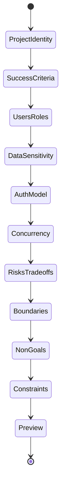

# Phase 2: Feature Implementation — Design

## Context

Phase 2 builds the three core generators on top of the Phase 1 foundation. Each generator has a dedicated UI flow and API endpoint. Output is template-based (no AI integration for MVP).

## Architecture Overview

```mermaid
graph TB
    subgraph Frontend
        KW[KickoffWizard]
        SC[SteeringConfigurator]
        HP[HooksPresetSelector]
        PV[PreviewPanel]
    end
    
    subgraph Backend API
        KA[/api/kickoff/generate]
        SA[/api/steering/generate]
        HA[/api/hooks/generate]
    end
    
    KW --> KA
    SC --> SA
    HP --> HA
    
    KA --> PV
    SA --> PV
    HA --> PV
```

## API Endpoints

### POST /api/kickoff/generate

Request:
```json
{
  "answers": {
    "projectIdentity": "string",
    "successCriteria": "string",
    "usersAndRoles": "string",
    "dataSensitivity": "string",
    "dataLifecycle": {
      "retention": "string",
      "deletion": "string",
      "export": "string",
      "auditLogging": "string",
      "backups": "string"
    },
    "authModel": "none | basic | external",
    "concurrency": "string",
    "risksAndTradeoffs": {
      "topRisks": ["string"],
      "mitigations": ["string"],
      "notHandled": ["string"]
    },
    "boundaries": "string",
    "boundaryExamples": ["string"],
    "nonGoals": "string",
    "constraints": "string"
  }
}
```

Response:
```json
{
  "prompt": "string (full generated prompt text)"
}
```

### POST /api/steering/generate

Request:
```json
{
  "config": {
    "projectName": "string",
    "projectDescription": "string",
    "techStack": {
      "backend": "string",
      "frontend": "string",
      "database": "string"
    },
    "includeConditional": true,
    "customRules": {
      "product": ["string"],
      "tech": ["string"],
      "structure": ["string"]
    }
  }
}
```

Response:
```json
{
  "files": [
    {
      "path": ".kiro/steering/product.md",
      "content": "string"
    },
    {
      "path": ".kiro/steering/tech.md",
      "content": "string"
    },
    {
      "path": "AGENTS.md",
      "content": "string"
    }
  ]
}
```

### POST /api/hooks/generate

Request:
```json
{
  "preset": "light | basic | default | strict",
  "techStack": {
    "hasGo": true,
    "hasTypeScript": true,
    "hasReact": true
  }
}
```

Response:
```json
{
  "files": [
    {
      "path": ".kiro/hooks/format-on-stop.kiro.hook",
      "content": "string (JSON hook definition)"
    }
  ]
}
```

## Frontend Components

### Page Structure

```
frontend/src/
├── components/
│   ├── kickoff/
│   │   ├── KickoffWizard.tsx      # Main wizard container
│   │   ├── QuestionStep.tsx       # Individual question step
│   │   └── PromptPreview.tsx      # Generated prompt preview
│   ├── steering/
│   │   ├── SteeringConfigurator.tsx
│   │   ├── FilePreview.tsx
│   │   └── SteeringOptions.tsx
│   ├── hooks/
│   │   ├── HooksPresetSelector.tsx
│   │   ├── PresetCard.tsx
│   │   └── HookFilePreview.tsx
│   └── shared/
│       ├── OutputPanel.tsx        # Preview/Copy/Download
│       └── StepIndicator.tsx
├── pages/
│   ├── KickoffPage.tsx
│   ├── SteeringPage.tsx
│   └── HooksPage.tsx
└── lib/
    └── api.ts                     # API client functions
```

### Kickoff Wizard Flow



### Question Steps (Strict Order)

| Step | Question | Sub-fields |
|------|----------|------------|
| 1 | Project Identity | Single sentence restatement |
| 2 | Success Criteria | What does "done" mean? |
| 3 | Users & Roles | anonymous/auth/admin/etc. |
| 4 | Data Sensitivity | What data stored? + Data Lifecycle (retention, deletion, export, audit, backups) |
| 5 | Auth Model | none / basic / external provider |
| 6 | Concurrency | multi-user? background jobs? shared state? |
| 7 | Risks & Tradeoffs | Top 3 risks, mitigations, not handled |
| 8 | Boundaries | public vs private + 2-3 concrete examples |
| 9 | Non-Goals | What will NOT be built |
| 10 | Constraints | time, simplicity, tech limits |

## Backend Structure

```
backend/internal/
├── api/
│   ├── router.go              # Add new routes
│   ├── health.go              # Existing
│   ├── kickoff.go             # Kickoff handler
│   ├── steering.go            # Steering handler
│   └── hooks.go               # Hooks handler
├── generator/
│   ├── kickoff.go             # Prompt generation logic
│   ├── steering.go            # Steering file generation
│   └── hooks.go               # Hook file generation
└── templates/
    ├── kickoff.tmpl           # Prompt template
    ├── steering/
    │   ├── product.tmpl
    │   ├── tech.tmpl
    │   ├── structure.tmpl
    │   ├── security-go.tmpl
    │   ├── security-web.tmpl
    │   ├── quality-go.tmpl
    │   ├── quality-web.tmpl
    │   └── agents.tmpl
    └── hooks/
        ├── format-go.tmpl
        ├── format-web.tmpl
        ├── lint.tmpl
        ├── test.tmpl
        ├── secret-scan.tmpl
        ├── prompt-guard.tmpl
        └── vuln-scan.tmpl
```

## Data Models

### KickoffAnswers

```go
type KickoffAnswers struct {
    ProjectIdentity   string           `json:"projectIdentity"`
    SuccessCriteria   string           `json:"successCriteria"`
    UsersAndRoles     string           `json:"usersAndRoles"`
    DataSensitivity   string           `json:"dataSensitivity"`
    DataLifecycle     DataLifecycle    `json:"dataLifecycle"`
    AuthModel         string           `json:"authModel"`
    Concurrency       string           `json:"concurrency"`
    RisksAndTradeoffs RisksTradeoffs   `json:"risksAndTradeoffs"`
    Boundaries        string           `json:"boundaries"`
    BoundaryExamples  []string         `json:"boundaryExamples"`
    NonGoals          string           `json:"nonGoals"`
    Constraints       string           `json:"constraints"`
}

type DataLifecycle struct {
    Retention    string `json:"retention"`
    Deletion     string `json:"deletion"`
    Export       string `json:"export"`
    AuditLogging string `json:"auditLogging"`
    Backups      string `json:"backups"`
}

type RisksTradeoffs struct {
    TopRisks    []string `json:"topRisks"`
    Mitigations []string `json:"mitigations"`
    NotHandled  []string `json:"notHandled"`
}
```

### SteeringConfig

```go
type SteeringConfig struct {
    ProjectName        string            `json:"projectName"`
    ProjectDescription string            `json:"projectDescription"`
    TechStack          TechStack         `json:"techStack"`
    IncludeConditional bool              `json:"includeConditional"`
    CustomRules        map[string][]string `json:"customRules"`
}

type TechStack struct {
    Backend  string `json:"backend"`
    Frontend string `json:"frontend"`
    Database string `json:"database"`
}
```

### HookConfig

```go
type HookConfig struct {
    Preset    string    `json:"preset"`
    TechStack TechStack `json:"techStack"`
}

type TechStack struct {
    HasGo         bool `json:"hasGo"`
    HasTypeScript bool `json:"hasTypeScript"`
    HasReact      bool `json:"hasReact"`
}
```

## Hook Schema

Each `.kiro.hook` file contains:

```json
{
  "name": "string",
  "description": "string",
  "version": "1.0.0",
  "enabled": true,
  "when": {
    "type": "agentStop | promptSubmit | userTriggered | fileEdited | fileCreated | fileDeleted",
    "patterns": ["**/*.go"]  // Required for file hooks
  },
  "then": {
    "type": "askAgent | runCommand",
    "command": "go fmt ./...",  // For runCommand
    "prompt": "string"          // For askAgent
  }
}
```

## Preset Definitions

| Preset | agentStop | promptSubmit | userTriggered |
|--------|-----------|--------------|---------------|
| Light | formatters | - | - |
| Basic | formatters + linters | - | tests |
| Default | formatters + linters + secret scan | prompt guardrails | tests |
| Strict | formatters + linters + secret scan + static analysis | prompt guardrails | tests + vuln scan |

## Steering File Frontmatter

```yaml
---
inclusion: always | fileMatch | manual
fileMatchPattern: "**/*.go"  # Only for fileMatch
---
```

## Output Panel Component

Shared component for all generators:
- Preview tab: syntax-highlighted content
- Copy button: copies to clipboard
- Download button: downloads as file(s)
- For multi-file output: zip download option
