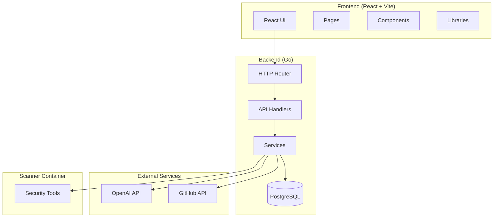

# Developer Documentation

This guide explains the architecture, components, and customization options for BetterKiroPrompts.

## Architecture Overview

BetterKiroPrompts is a full-stack application with a Go backend serving a React frontend. The backend provides a JSON API and serves the built frontend as static files.



### Component Relationships

1. **Frontend → Backend**: The React frontend communicates with the Go backend via REST API calls to `/api/*` endpoints.

2. **Backend → Database**: Services use the storage layer to persist data in PostgreSQL.

3. **Backend → OpenAI**: The generation and scanner services use the OpenAI client for AI-powered features.

4. **Backend → Scanner Container**: Security scanning runs tools in a separate Docker container with security tools pre-installed.

## Backend Packages

All backend code lives in `backend/internal/`. Each package has a specific responsibility:

### api
HTTP handlers and middleware for all API endpoints.

Key files:
- `router.go` - Route definitions and middleware chain
- `generate.go` - Generation endpoints (`/api/generate/*`)
- `gallery.go` - Gallery endpoints (`/api/gallery/*`)
- `scan.go` - Scanner endpoints (`/api/scan/*`)
- `middleware.go` - Request logging, recovery, request ID
- `errors.go` - Standardized error responses

### config
Centralized configuration loading from `config.toml` with environment variable overrides.

Key interfaces:
```go
// Load reads configuration with precedence: defaults → file → env vars
func Load() (*Config, error)

// Config holds all application configuration
type Config struct {
    Server     ServerConfig
    OpenAI     OpenAIConfig
    RateLimit  RateLimitConfig
    Logging    LoggingConfig
    Scanner    ScannerConfig
    Generation GenerationConfig
    Gallery    GalleryConfig
}
```

### db
Database connection management and migrations.

Key functions:
```go
// Connect establishes the database connection
func Connect(ctx context.Context) error

// Close closes the database connection
func Close() error
```

Migrations are in `backend/migrations/` and run automatically on startup.

### gallery
Gallery service for browsing and rating generations.

Key interfaces:
```go
type Service struct { ... }

func (s *Service) ListGenerations(ctx context.Context, req ListRequest) (*ListResponse, error)
func (s *Service) GetGenerationWithView(ctx context.Context, id, ipHash string) (*Generation, error)
func (s *Service) RateGeneration(ctx context.Context, genID string, score int, voterHash, clientIP string) (int, error)
```

### generation
AI-driven generation of questions and output files.

Key interfaces:
```go
type Service struct { ... }

func (s *Service) GenerateQuestions(ctx context.Context, projectIdea, experienceLevel string) ([]Question, error)
func (s *Service) GenerateOutputs(ctx context.Context, projectIdea string, answers []Answer, experienceLevel, hookPreset string) ([]GeneratedFile, error)
```

### logger
Structured logging with file rotation and colored console output.

Key interfaces:
```go
type Logger struct { ... }

func (l *Logger) App() *slog.Logger    // Application logs
func (l *Logger) HTTP() *slog.Logger   // HTTP request logs
func (l *Logger) DB() *slog.Logger     // Database logs
func (l *Logger) Scanner() *slog.Logger // Scanner logs
func (l *Logger) Client() *slog.Logger  // Frontend error logs
```

### openai
OpenAI API client with retry logic and structured responses.

Key interfaces:
```go
type Client struct { ... }

func (c *Client) ChatCompletion(ctx context.Context, messages []Message) (string, error)
```

### prompts
AI prompt templates for question and output generation.

Key functions:
```go
func GetQuestionsSystemPrompt(experienceLevel string) string
func GetOutputsSystemPrompt(experienceLevel, hookPreset string) string
```

### queue
Request queuing for rate limiting concurrent AI requests.

### ratelimit
IP-based rate limiting with configurable limits per time window.

Key interfaces:
```go
type Limiter struct { ... }

func (l *Limiter) Allow(ip string) (allowed bool, retryAfter time.Duration)
```

### sanitize
Input sanitization for security.

### scanner
Security scanning orchestration including cloning, tool execution, and AI review.

Key components:
- `service.go` - Main orchestration service
- `cloner.go` - Git repository cloning
- `tools.go` - Security tool execution
- `reviewer.go` - AI-powered code review
- `aggregator.go` - Finding deduplication and processing

### storage
Data persistence layer with PostgreSQL implementation.

Key interfaces:
```go
type Repository interface {
    CreateGeneration(ctx context.Context, gen *Generation) error
    GetGeneration(ctx context.Context, id string) (*Generation, error)
    ListGenerations(ctx context.Context, filter ListFilter) ([]Generation, int, error)
    CreateOrUpdateRating(ctx context.Context, genID string, score int, voterHash string) error
    // ... more methods
}
```


## Frontend Structure

The frontend is a React SPA built with Vite and styled with shadcn/ui components.

### Pages (`frontend/src/pages/`)

| Page | Description |
|------|-------------|
| `LandingPage.tsx` | Main generation flow: experience level → project input → questions → outputs |
| `GalleryPage.tsx` | Browse and rate community generations |
| `SecurityScanPage.tsx` | Repository security scanning interface |
| `InfoPage.tsx` | About page with feature descriptions |

### Components (`frontend/src/components/`)

#### Generation Flow
- `ExperienceLevelSelector.tsx` - Beginner/Novice/Expert selection
- `ProjectInput.tsx` - Project idea text input with examples
- `HookPresetSelector.tsx` - Light/Basic/Default/Strict hook preset selection
- `QuestionFlow.tsx` - Step-through question answering
- `OutputEditor.tsx` - Generated file viewer with syntax highlighting

#### Gallery
- `Gallery/GalleryList.tsx` - Paginated list with filtering
- `Gallery/GalleryDetail.tsx` - Full generation detail modal
- `Gallery/Rating.tsx` - Star rating component

#### Security Scanning
- `ScanProgress.tsx` - Scan status and progress display
- `ScanResults.tsx` - Findings display with severity indicators

#### Shared
- `shared/Header.tsx` - Main header with navigation
- `shared/CompactHeader.tsx` - Minimal header for generation flow
- `shared/LoadingState.tsx` - Loading indicators with progress
- `shared/ErrorMessage.tsx` - Error display with retry options
- `shared/NightSkyBackground.tsx` - Animated background

#### UI (shadcn/ui)
- `ui/button.tsx`, `ui/card.tsx`, `ui/input.tsx`, etc.

### Libraries (`frontend/src/lib/`)

| File | Purpose |
|------|---------|
| `api.ts` | Backend API client with typed requests/responses |
| `storage.ts` | LocalStorage session persistence |
| `logger.ts` | Frontend error logging to backend |
| `voter.ts` | Anonymous voter hash generation |
| `syntax.ts` | Syntax highlighting utilities |
| `zip.ts` | ZIP file generation for downloads |
| `utils.ts` | General utilities (cn, etc.) |

### Component Hierarchy

```
App.tsx
├── LandingPage
│   ├── ExperienceLevelSelector
│   ├── ProjectInput
│   ├── HookPresetSelector
│   ├── QuestionFlow
│   ├── LoadingState
│   ├── OutputEditor
│   │   └── SyntaxHighlighter
│   └── ErrorMessage
├── GalleryPage
│   ├── GalleryList
│   └── GalleryDetail
│       └── Rating
├── SecurityScanPage
│   ├── ScanProgress
│   └── ScanResults
└── InfoPage
```

## Database Schema

### Tables

#### categories
Stores generation categories for filtering.

```sql
CREATE TABLE categories (
    id SERIAL PRIMARY KEY,
    name VARCHAR(50) NOT NULL UNIQUE,
    keywords TEXT[] NOT NULL DEFAULT '{}'
);
```

Default categories: API, CLI, Web App, Mobile, Other

#### generations
Stores generated outputs for the gallery.

```sql
CREATE TABLE generations (
    id UUID PRIMARY KEY DEFAULT gen_random_uuid(),
    project_idea TEXT NOT NULL,
    experience_level VARCHAR(20) NOT NULL,
    hook_preset VARCHAR(20) NOT NULL,
    files JSONB NOT NULL,
    category_id INTEGER REFERENCES categories(id),
    avg_rating DECIMAL(3,2) DEFAULT 0,
    rating_count INTEGER DEFAULT 0,
    view_count INTEGER DEFAULT 0,
    created_at TIMESTAMP WITH TIME ZONE DEFAULT NOW()
);
```

#### ratings
Stores user ratings with IP-based deduplication.

```sql
CREATE TABLE ratings (
    id UUID PRIMARY KEY DEFAULT gen_random_uuid(),
    generation_id UUID REFERENCES generations(id) ON DELETE CASCADE,
    score SMALLINT NOT NULL CHECK (score >= 1 AND score <= 5),
    voter_hash VARCHAR(64) NOT NULL,
    created_at TIMESTAMP WITH TIME ZONE DEFAULT NOW(),
    UNIQUE(generation_id, voter_hash)
);
```

#### views
Tracks unique views per IP for accurate view counts.

```sql
CREATE TABLE views (
    id UUID PRIMARY KEY DEFAULT gen_random_uuid(),
    generation_id UUID REFERENCES generations(id) ON DELETE CASCADE,
    ip_hash VARCHAR(64) NOT NULL,
    created_at TIMESTAMP WITH TIME ZONE DEFAULT NOW(),
    UNIQUE(generation_id, ip_hash)
);
```

#### scan_jobs
Tracks security scan requests and status.

```sql
CREATE TABLE scan_jobs (
    id VARCHAR(36) PRIMARY KEY,
    repo_url TEXT NOT NULL,
    status VARCHAR(20) NOT NULL DEFAULT 'pending',
    languages TEXT[] DEFAULT '{}',
    error TEXT,
    created_at TIMESTAMP WITH TIME ZONE DEFAULT NOW(),
    completed_at TIMESTAMP WITH TIME ZONE,
    expires_at TIMESTAMP WITH TIME ZONE DEFAULT NOW() + INTERVAL '7 days'
);
```

Status values: `pending`, `cloning`, `scanning`, `reviewing`, `completed`, `failed`

#### scan_findings
Stores individual security findings from scans.

```sql
CREATE TABLE scan_findings (
    id VARCHAR(36) PRIMARY KEY,
    scan_job_id VARCHAR(36) REFERENCES scan_jobs(id) ON DELETE CASCADE,
    severity VARCHAR(10) NOT NULL,
    tool VARCHAR(50) NOT NULL,
    file_path TEXT NOT NULL,
    line_number INTEGER,
    description TEXT NOT NULL,
    remediation TEXT,
    code_example TEXT,
    created_at TIMESTAMP WITH TIME ZONE DEFAULT NOW()
);
```

### Migration Process

Migrations are SQL files in `backend/migrations/` with naming format:
```
YYYYMMDDHHMMSS_description.sql
```

Migrations run automatically on application startup. The database tracks which migrations have been applied.

To add a new migration:
1. Create a new SQL file with the next timestamp
2. Include both `CREATE` and any necessary `ALTER` statements
3. Restart the application to apply


## Logging System

BetterKiroPrompts uses structured logging with category-specific log files.

### Log Categories

| Category | File Pattern | Purpose |
|----------|--------------|---------|
| app | `YYYY-MM-DD-app.log` | Application events, service operations |
| http | `YYYY-MM-DD-http.log` | HTTP requests and responses |
| db | `YYYY-MM-DD-db.log` | Database queries and operations |
| scanner | `YYYY-MM-DD-scanner.log` | Security scan operations |
| client | `YYYY-MM-DD-client.log` | Frontend errors sent to backend |

### Log Format

Logs are written in JSON format for easy parsing:

```json
{
  "time": "2026-01-14T10:30:00Z",
  "level": "INFO",
  "msg": "generation_complete",
  "component": "app",
  "request_id": "abc123",
  "duration": "2.5s",
  "file_count": 6
}
```

### Log Levels

| Level | Usage |
|-------|-------|
| DEBUG | Detailed debugging information |
| INFO | Normal operational events |
| WARN | Warning conditions that don't prevent operation |
| ERROR | Error conditions that affect operation |

### Configuration

Configure logging in `config.toml`:

```toml
[logging]
level = "INFO"           # DEBUG, INFO, WARN, ERROR
directory = "./logs"     # Log file directory
max_size_mb = 100        # Max size before rotation
max_age_days = 7         # Days to retain old logs
enable_color = true      # Colored console output
```

### Runtime Level Changes

Change log level at runtime via API:

```bash
# Get current level
curl http://localhost:8090/api/admin/log-level

# Set new level
curl -X POST http://localhost:8090/api/admin/log-level \
  -H "Content-Type: application/json" \
  -d '{"level": "DEBUG"}'
```

## Adding New Features

### Adding a New API Endpoint

1. Create handler in `backend/internal/api/`:

```go
// myfeature.go
func HandleMyFeature(w http.ResponseWriter, r *http.Request) {
    // Implementation
}
```

2. Register route in `router.go`:

```go
mux.HandleFunc("GET /api/myfeature", HandleMyFeature)
```

3. Add frontend API client in `frontend/src/lib/api.ts`:

```typescript
export async function myFeature(): Promise<MyResponse> {
  return fetchAPI<MyResponse>('/api/myfeature')
}
```

### Adding a New Service

1. Create package in `backend/internal/myservice/`:

```go
// service.go
package myservice

type Service struct {
    // dependencies
}

func NewService(/* deps */) *Service {
    return &Service{/* ... */}
}
```

2. Initialize in `main.go`:

```go
myService := myservice.NewService(/* deps */)
routerCfg.MyService = myService
```

### Adding a New Frontend Page

1. Create page component in `frontend/src/pages/`:

```tsx
// MyPage.tsx
export function MyPage({ onBack }: { onBack: () => void }) {
  return (
    <div>
      {/* Page content */}
    </div>
  )
}
```

2. Add view state and navigation in `App.tsx`:

```tsx
type AppView = 'main' | 'gallery' | 'info' | 'scan' | 'mypage'

// Add handler
const handleOpenMyPage = useCallback(() => {
  setCurrentView('mypage')
}, [])

// Add view rendering
if (currentView === 'mypage') {
  return <MyPage onBack={() => setCurrentView('main')} />
}
```

## Customizing AI Prompts

AI prompts are defined in `backend/internal/prompts/`. The system uses a two-phase approach:

### Phase 1: Question Generation

The system generates contextual questions based on the project idea and experience level.

Key files:
- `questions.go` - Question generation prompts

To customize questions:
1. Edit `QuestionsSystemPrompt()` to change the AI's behavior
2. Modify question count ranges in `config.toml`

### Phase 2: Output Generation

The system generates kickoff prompts, steering files, hooks, and AGENTS.md.

Key files:
- `kickoff.go` - Kickoff prompt template
- `steering.go` - Steering file templates and validation
- `hooks.go` - Hook file templates and presets
- `agents.go` - AGENTS.md template

To customize outputs:
1. Edit templates in the respective files
2. Modify validation rules in `validation.go`

### Experience Levels

Three experience levels affect prompt complexity:

| Level | Description |
|-------|-------------|
| beginner | Detailed explanations, simpler concepts |
| novice | Balanced detail, standard complexity |
| expert | Concise, assumes knowledge |

### Hook Presets

Four hook presets control automation level:

| Preset | Hooks Included |
|--------|----------------|
| light | Format on save only |
| basic | Format + lint |
| default | Format + lint + test |
| strict | All hooks + commit checks |

## Testing

### Backend Tests

Run all backend tests:
```bash
cd backend
go test ./...
```

Run with coverage:
```bash
go test -cover ./...
```

### Frontend Tests

Run all frontend tests:
```bash
cd frontend
pnpm test
```

Run with coverage:
```bash
pnpm test:coverage
```

### Property-Based Tests

Property tests use `testing/quick` for Go. They're in files named `*_property_test.go`.

Example:
```go
func TestConfigRoundTrip(t *testing.T) {
    f := func(cfg Config) bool {
        // Property: serialize then deserialize equals original
        data, _ := toml.Marshal(cfg)
        var parsed Config
        toml.Unmarshal(data, &parsed)
        return reflect.DeepEqual(cfg, parsed)
    }
    if err := quick.Check(f, nil); err != nil {
        t.Error(err)
    }
}
```

## Code Quality

### Backend

```bash
cd backend
golangci-lint run
go fmt ./...
go vet ./...
```

### Frontend

```bash
cd frontend
pnpm typecheck
pnpm lint
pnpm build
```

Run these after each major task to ensure code quality.
