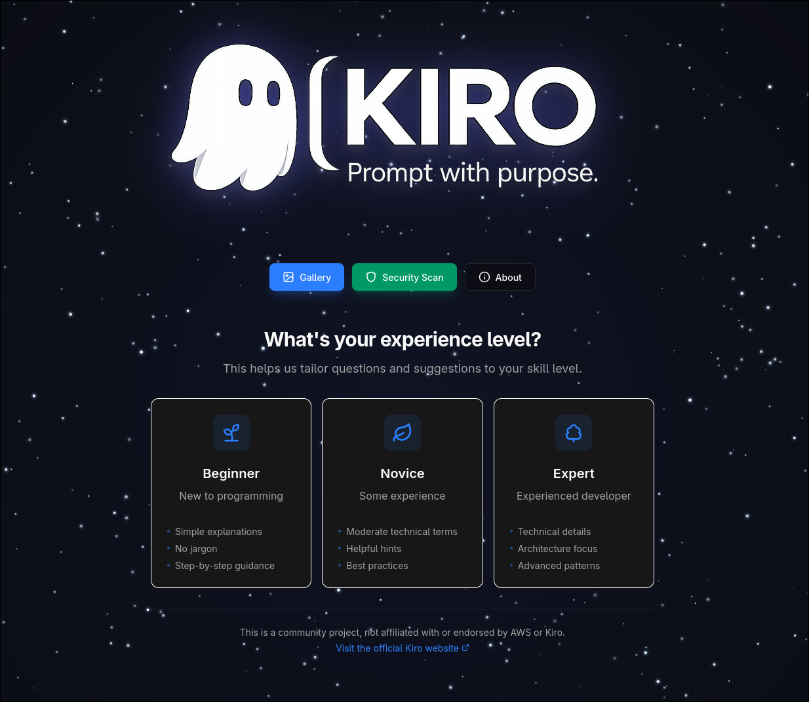
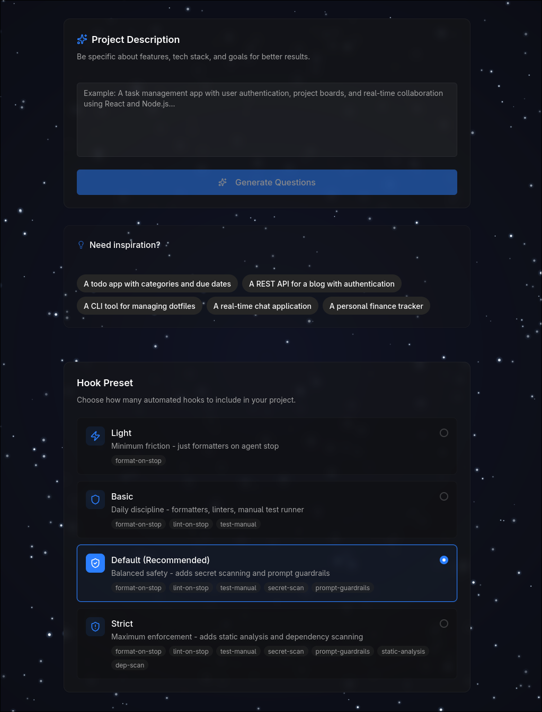
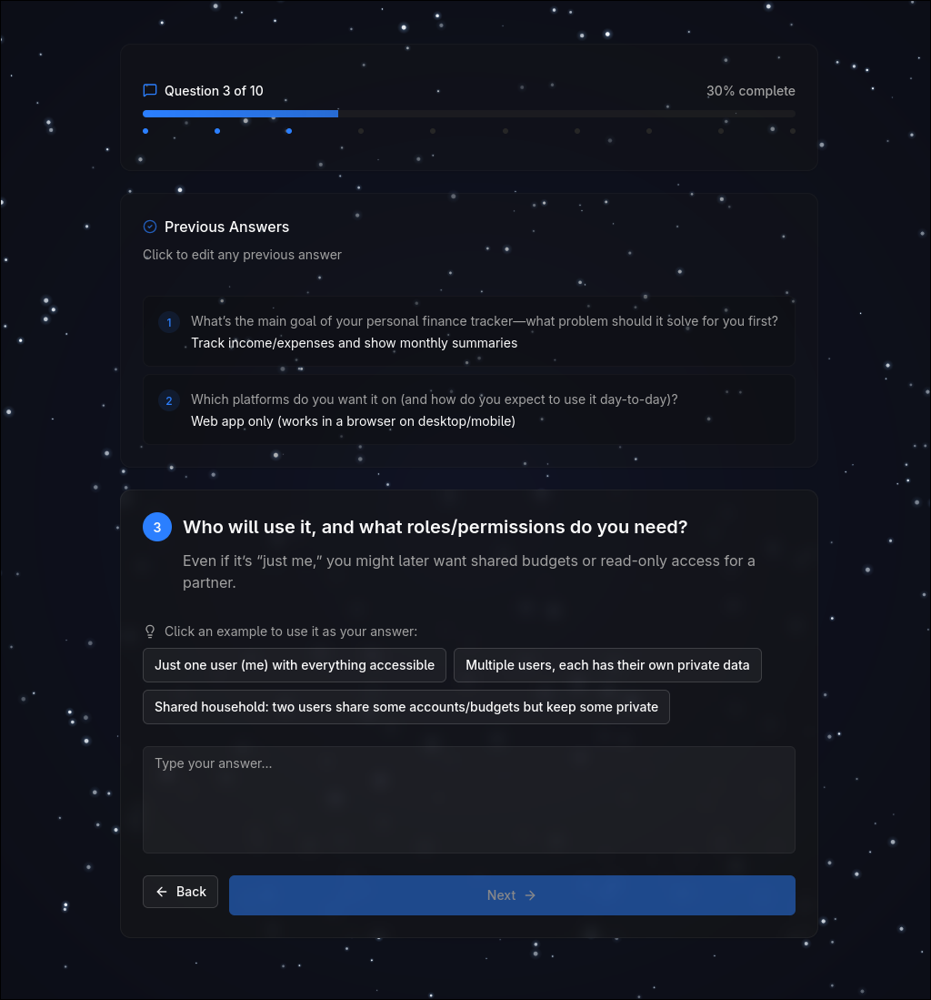
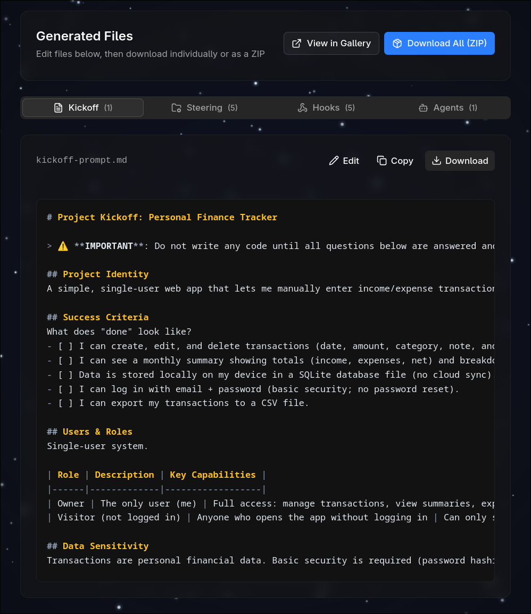
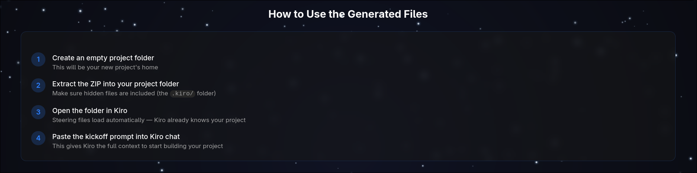
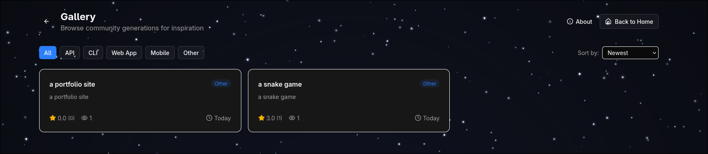

# Screenshots

Visual tour of BetterKiroPrompts features.

## Main Interface

The landing page where you start your journey — enter your project idea and select your experience level.

## Generation Flow

### Step 1: Answer Questions

After entering your project idea, the AI generates contextual questions tailored to your experience level.

### Step 2: Review & Customize

Fine-tune your answers and see the AI adapt its understanding of your project.

### Step 3: Get Your Results

Receive your complete Kiro configuration — kickoff prompt, steering files, hooks, and AGENTS.md.

## How to Use Generated Files

Quick reference showing how to apply the generated outputs to your Kiro project.

## Community Gallery

Browse configurations shared by other users. Filter by category, sort by popularity or recency, and rate helpful submissions.

## Security Scanner

Scan GitHub repositories for vulnerabilities using Trivy, Semgrep, TruffleHog, and Gitleaks — plus AI-powered code review.

